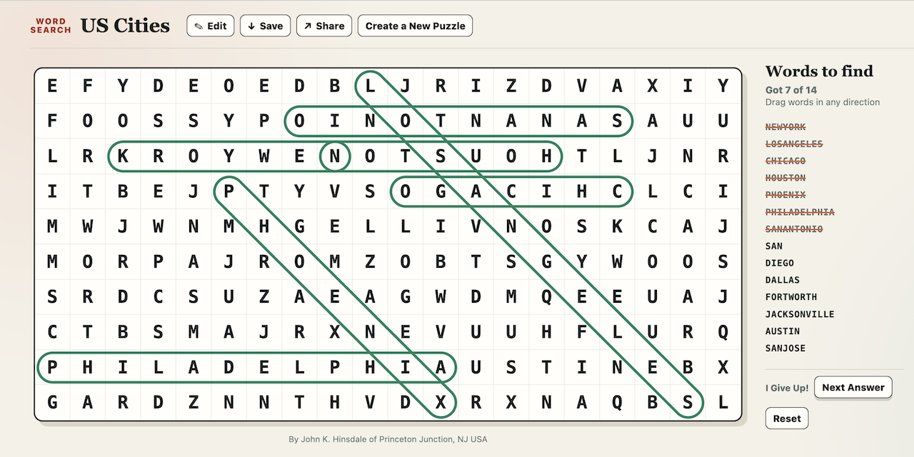

# Word Search Generator, by John K. Hinsdale

**Try it!** Click here to [Open the app page](https://jhinsdale.github.io/wordsearch/wordsearch.html)

**Demos:**

- U.S. States: [clues shown](https://jhinsdale.github.io/wordsearch/wordsearch.html?p=H4sIAAAAAAAAE02SQWvcQAyF_40vImG3d59y6akUQulZO6N4VM9IRpJ34v31ZbyBFgT6HoInnlDTTPM2BUel-dfr-yu8Bwb51DlHmb9dpkK8lBjU1bLPWPGGDQEr-oqAxg-V0VcUR4eElT_UhBGSVjXMCklFKAWnPSBTxY5G8FHVOCMspLYwQsGOzMAZiwLXyqLswJIZBYG1I3ytWEliT-sBVXf2c9yQhaChHRUlQ0N3TGV3inBonAovKNBYhFwDobH7qG3jk3U3hqYSw0zoZmc4oTvm0fpLwbZ5YaNT_SFzOk5s9MlJTzzUVhC1KC8JTSsPr1NmXMdWLayga8WiDUGNFhXYSMSPesdxMiuaif0M4br_7_SUX05BI4kTQdAnOuyBBe5kIwLc2RYebh29sCyhAp08Xv4N2JOKs0A_tLEskxftb3Unn6-Tq8WTLxNlDrxVmi8T1qr9B_Wf--NRab5OuIf-Pv_kyd-fr3KdNtPFyH3-C1_N7yBfAgAA) | [clues hidden](https://jhinsdale.github.io/wordsearch/wordsearch.html?p=H4sIAAAAAAAAE02SQYvcMAyF_00uYpbZ3nPqpadSWErPGlsbq7GlICnjzfz64syWFgT6HoInnlDTTPM2BUel-efL2wu8BQb51DlHmb9cp0K8lBjU1bLPWPGGDQEr-oqAxg-V0VcUR4eEld_VhBGSVjXMCklFKAWnPSBTxY5G8F7VOCMspLYwQsGOzMAZiwLXyqLswJIZBYG1I3yuWEliT-sBVXf2c9yQhaChHRUlQ0N3TGV3inBonAovKNBYhFwDobH7qG3jk3U3hqYSw0zoZmc4oTvm0fqlYNu8sNGpfpM5HSc2-uCkJx5qK4halEtC08rD65QZ17FVCyvoWrFoQ1CjRQU2EvGj3nGczIpmYj9DuO7_Oz3lp1PQSOJEEPSBDntggTvZiAB3toWHW0cvLEuoQCePy78Be1JxFuiHNpZl8qL9a93J5-vkavGXKXPgrdJ8nbBW7d-p_9gfj0rz64R76K_zT5787fkqr9Nmuhi5z38AYXytrl8CAAA)
- South American Countries: [clues shown](https://jhinsdale.github.io/wordsearch/wordsearch.html?p=H4sIAAAAAAAAEy3OMW7DMAxA0dto4RIfQEORpVNQoENn2iIkArRoUGSE-PRBk2wPf_q7FspHcnah_KvhDb52Mt6ww1WjuzGNNLl4y8uSGnFt_q-pVkZGq9SdO8KqwndGWA1PFtgaC8GmovvKCLQFFjWo8cCOcKBhDXzAQRYwwrjjThAWr3qnTmeQYBpN51WCRl7SUPO3L4kKO65C-ZJQROeN5k-cp1BeEobr33v45e_PczpMq9EY-QmnKr5l9QAAAA) | [clues hidden](https://jhinsdale.github.io/wordsearch/wordsearch.html?p=H4sIAAAAAAAAEzXOMW7DMAxA0dto4RIfQEORpVNRoENn2iIkArRoUGSE-PRBk3R7-NPftVA-krML5R8Nb_Cxk_GGHa4a3Y1ppMnFW16W1Ihr8z9NtTIyWqXu3BFWFb4xwmp4ssDWWAg2Fd1XRqAtsKhBjTt2hAMNa-AdDrKAEcYdd4KweNYbdTqDBNNoOq8SNPIlDTX_NxV2XIXyJaGIzi-a33GeQnlJGK6_r-GnP9_P6TCtRmPkB5mb_Ov1AAAA)
- European Countries: [clues shown](https://jhinsdale.github.io/wordsearch/wordsearch.html?p=H4sIAAAAAAAAEy2SwY7cMAiG3yYXNNJM7zmtKvVU9dYzsVmbxoYI42STp6-c2dP3g0A_IKpGmrfJ2QvNP7vpRijwoV3cmNp0cPQ8_3hOmThlH-pQi23GsqAwAkpUMwS0Snfcm9vgRbYg_0OBhQpab4OJe4VFmzA-MtlFSXcWhKWXhKMtmKIPnttoCReFzAiRpKKtQM11uHyyFJQIn4YSCBKpJUZIZBXlhGREgSB3SWgncKC7mu2bjuWEFS9cc3MUWLXprlDQd0YoTCE7SXNigcKe-71q6V9UF-2WoGJxhKol6j4oGHTASSiZgpBnsmHWQNQ8PyoGivfsonbgCZves2xq3hMWMK23i_XWGKGhPCoai0IjW0am6I7rt7hv3TZkgXZQpAH26-0J3m3lk6CvhiwEXdgpPlaWFLXCjs4B5RHYz6llPT5Kpza_pqbmb_2cKLLjUmh-TliKHr_p-NOvq9D8mrC7_r0_461_vZ_jNW2myai1-T8ITbrQWAIAAA) | [clues hidden](https://jhinsdale.github.io/wordsearch/wordsearch.html?p=H4sIAAAAAAAAEzWSwY7dMAhF_yYb9KQ33Wc1qtRV1V3XxGZsJjZEGCdNvr5y3szqXBDoAqJqpHmbnL3Q_LObboQC79rFjalNB0fP84_nlIlT9qEOtdhmLAsKI6BENUNAq3THvbkNXmQL8icKLFTQehtM3Css2oTxkckuSrqzICy9JBxtwRR98NxGS7goZEaIJBVtBWquw-WDpaBE-DCUQJBILTFCIqsoJyQjCgS5S0I7gQPd1WxfdCwnrHjhmpujwKpNd4WCvjNCYQrZSZoTCxT23O9VS_9HddFuCSoWR6haou6DgkEHnISSKQh5JhtmDUTN86NioHjPLmoHnrDpPcum5j1hAdN6u1hvjREayqOisSg0smVkiu64fon71m1DFmgHRRpgv16e4N1WPgn6ashC0IWd4mNlSVEr7OgcUB6B_Zxa1uO9dGrzc2pq_q0psuNSaH5OWIoev-n406-r0Pw2YXf9e3_GS_96PcfbtJkmo9bm_zb8-F5YAgAA)

Word Search lets you create, play, and share word-search puzzles in a web browser. Open `wordsearch.html` to begin. Nothing needs to be installed.

Select the round **i** button for a brief guide inside the app. In play mode, it explains the available actions and includes **Edit** only when editing is allowed.

## Creating a Puzzle

### Enter the puzzle

1. Enter a **Puzzle title**.
2. Enter the **Words to hide**, separated by spaces or new lines. Use dashes to separate multi-word clues.
3. Select the clue options you want.
4. Select **Play** to preview the puzzle.

If information is missing or invalid, an alert appears at the top of the editor and focus moves to the field that needs attention.

Use the **×** beside **Words to hide** to clear the list after confirming. The word box grows automatically to a maximum of 10 lines, then scrolls. Drag it larger when more visible lines are wanted.

Use **Save** at the top of the editor to copy a link to the current editor state. Use **Reset** to clear the entire form and begin again. You must confirm before the puzzle is cleared.

You may set the grid width and height yourself; otherwise, the grid is sized automatically to accommodate the words and prefers a square.
Each automatic dimension has an **(auto)** label beside its box.
This automatic or manual status survives playing, saving, sharing, and reloading.
An out-of-range width or height immediately shows an error at the top of the editor and marks the invalid box red.

### Choose the clue options

Clue words are shown by default. Select **Hide clue words** if players should discover the list as they solve the puzzle.

When clue words are hidden, the list starts empty. Each word appears under **Words** after it is found.

**Display clues alphabetically** sorts the play-mode word list. Leave it unchecked to use the order entered in the editor.

### Word-list rules

- Separate clues with spaces or new lines.
- Use dashes to separate multi-word clues. For example, `new-york` appears as `NEW YORK` in the clue list and as `NEWYORK` in the grid.
- Each clue must contain at least two letters. Dashes do not count as letters.
- A puzzle may contain up to 80 words.
- A word must fit within the selected grid size.
- Duplicate words are included only once.
- A word and its reverse, such as `god` and `dog`, cannot both be used because the same selection would be ambiguous.

## Play the Puzzle

### Find words

Drag from one end of a word to the other, or click or tap its start and end letters. Words may run horizontally, vertically, or diagonally in either direction.

- A thin yellow outline shows the current selection without coloring the cells.
- A correct word briefly gets a green outline, which remains around the completed word.
- An incorrect selection briefly gets a red outline.
- **Reveal!** draws a yellow outline across the revealed word before marking it green.
- **Got N of M** shows your progress.
- Finding the final word flashes every grid square light green three times.

Only the intended location of a word counts. For example, if `kansas` and `arkansas` are both clues, they have separate locations. Selecting the `KANSAS` letters inside `ARKANSAS` does not count.

### Controls

- **Create a New Puzzle** — Leave play mode and open a blank editor, when the author allows it.
- **Edit** — Return to the puzzle generator, when editing is allowed.
- **Save** — Copy a link containing current progress.
- **Share** — Copy a clean, unplayed puzzle link.
- **Reveal!** — Reveal the next unfound word.
- **Reset** — Clear all progress and start again. Confirmation is required when at least one answer has been found.

### Continue later

The page remembers progress in its URL. Reloading the page restores found words. Use **Save** to copy that state and continue on the same or another device.

## Sharing a Puzzle

The editor's **Sharing Options** section creates a clean puzzle link.

1. Under **Invite players to**, select **Edit this puzzle** if people receiving the link should have an **Edit** button. It is off by default.
2. Leave **Create a new puzzle** selected if they should have a **Create a New Puzzle** button. It is on by default.
3. Select **Copy**.
4. Send the copied link to the players.

While playing, **Share** also copies a clean puzzle link. It never includes the current player's answers. Use **Save** instead when the link should include progress.

Puzzle information is carried in the link. The page does not upload the puzzle to a server.

## If a Puzzle Cannot Be Created

If the words cannot be placed, increase the grid size or remove some words. The maximum grid size is 30 × 30.

Use a current web browser. If automatic copying is unavailable, the page selects the link so it can be copied manually.
